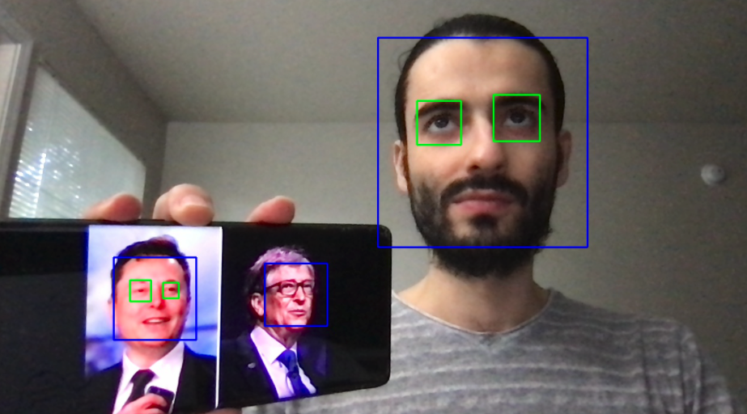

# face-detection-app

This is real-time face and eye detection app. It uses your machine's webcam for face detection.

## Technologies

**Python 3.8**
#### You can find required libraries in requirements.txt.

## How to use
1. Clone the repo: ``` git clone "https://github.com/MRyderOC/face-detection-app.git" ```.
2. Create a virtual environment: ```python3 -m venv myenv```.
3. Activate the virtual environment: ```source myenv/bin/activate```
4. Install dependencies: ```pip3 install -r requirements.txt```.
5. Run the app: ```flask run```.
6. Open your browser and go to this [link](http://127.0.0.1:5000/).
7. Enjoy!

## Results



## Acknowledgments

* These scripts uses Haar Cascade Classifier same as [OpenCV](https://opencv.org/). You can find the raw files [here](https://github.com/opencv/opencv/tree/master/data/haarcascades). Also, find the underlying idea in [this](https://www.cs.cmu.edu/~efros/courses/LBMV07/Papers/viola-cvpr-01.pdf) paper.
* Thanks to [Krish](https://github.com/krishnaik06) for the instructions.
